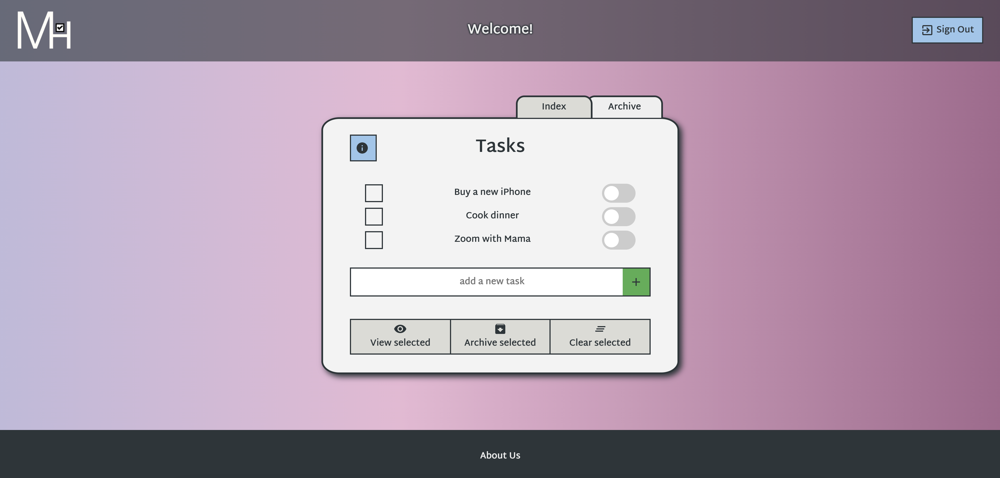
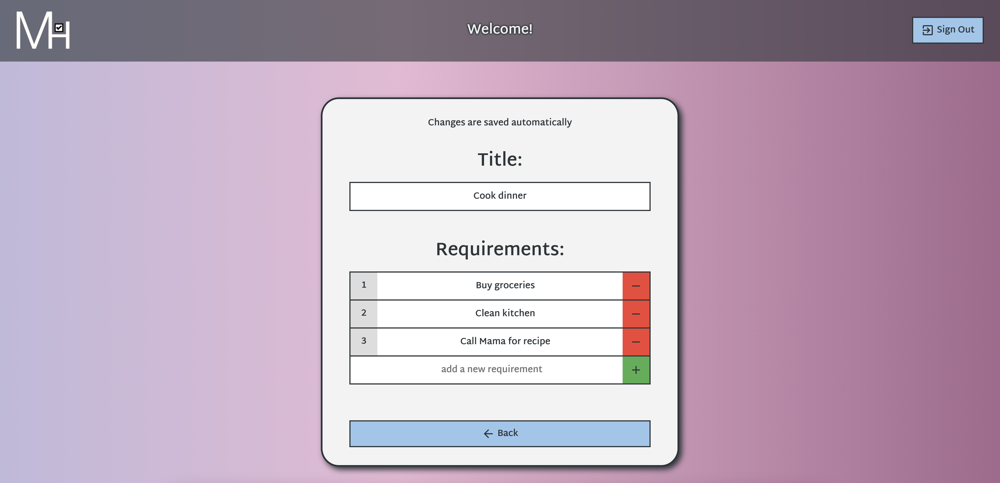
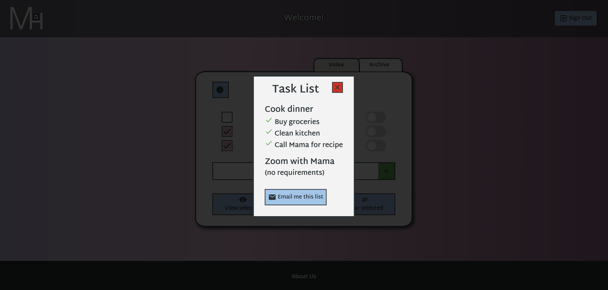
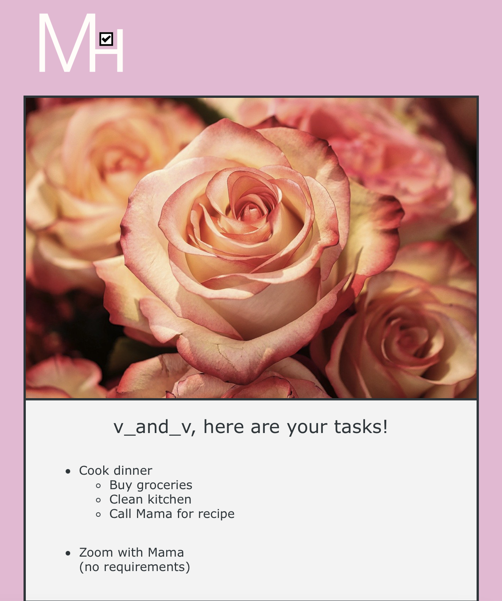
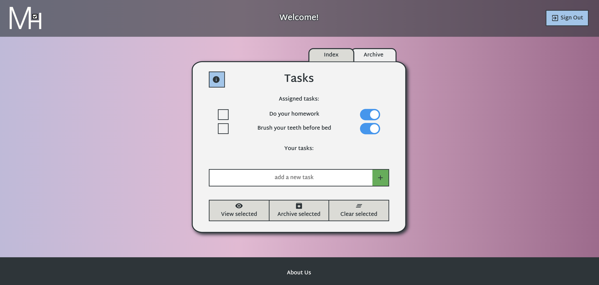
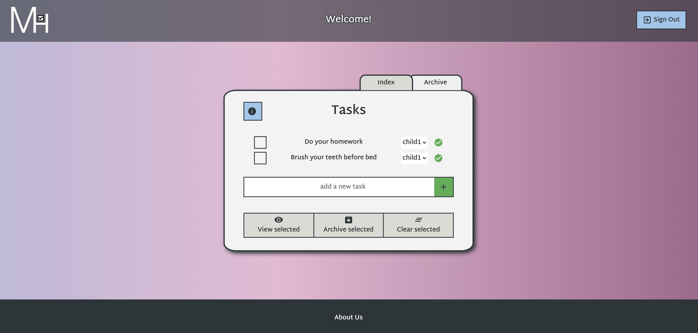
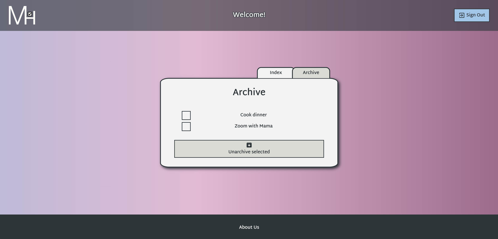

# Mama's Helper

[Live Link](http://mamashelper.herokuapp.com/)

Mama's Helper is a mobile optimized app that allows users to make sure they have everything they need for the tasks they have for the day.

## Key Features
- Intuitive to-do list and task management

- "Mama users" can assign tasks to household "child users" to complete

- Tasks can be archived and unarchived

- Mobile-friendly, responsive user interface

## Navigation
Homepage

  

Create and edit tasks

  

View selected tasks

  

Receive selected tasks by email

  

Assign tasks to children
  
  

Mark tasks as complete

  

"Mama user" receives task updates after completion

  

Archive tasks to reuse later
  
  

## Upcoming Features
- Schedule push notifications for task reminders
- "Mama's Tips" chatroom
